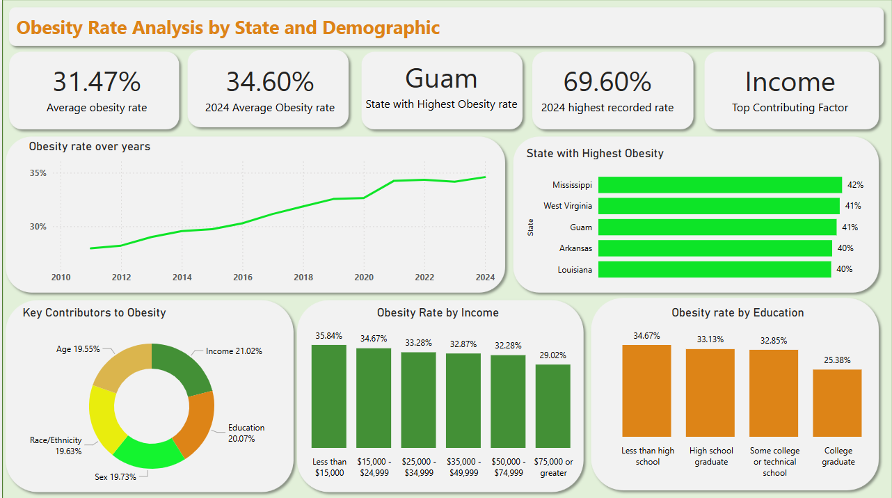

# Obesity Trends and Drivers Analysis (Power BI)

## 📌 Overview

This project presents an interactive Power BI dashboard analyzing obesity rates across different states and demographic groups. The goal is to move beyond surface-level reporting and uncover key patterns, trends, and contributing factors influencing obesity.

The dashboard focuses on answering three main questions:

- How have obesity rates changed over time?

- Which states are most affected in 2024?

- What demographic factors contribute the most to obesity in 2024?

---

## 📂 Data Source and Context

The dataset used in this project is sourced from the CDC’s Behavioral Risk Factor Surveillance System (BRFSS), available via Data.gov

It provides state-level data on adult obesity, including factors such as diet, physical activity, and demographic breakdowns (e.g. income, education, age, and race/ethnicity)

### [View Dataset source](https://catalog.data.gov/dataset/nutrition-physical-activity-and-obesity-behavioral-risk-factor-surveillance-system)

---
## 📊 Live Dashboad
You can explore the interactive dashboard here:

👉 [View Interactive Power BI Dashboard](https://app.powerbi.com/links/kFckgVVSM5?ctid=1d88dda3-60c9-40a7-b84c-bdf567127bb4&pbi_source=linkShare)

---
  
## 🎯 Key Performance Indicators (KPIs)

- Average Obesity Rate: Overall obesity level across all data

- Latest Year Obesity Rate (2024):  Most recent trend snapshot

- State with Highest Obesity Rate: Identifies the most affected region

- Highest Recorded Obesity Rate: Peak value in dataset

- Top Contributing Factor: Category most associated with higher obesity rates

---
## 🧠 Key Insights

- Obesity rates have steadily increased over time

- Certain states consistently show higher obesity prevalence

- Income is the strongest contributing factor among the categories analyzed

- Lower income groups tend to experience higher obesity rates

- Education level also shows a notable relationship with obesity patterns

---

## 💼 State Recommendations

### Target Low-Income Communities 
Income is the strongest factor in obesity. Public health initiatives should focus on lower-income groups through affordable healthy food programs, community wellness initiatives, and improved access to healthcare.

### Invest in Education and Awareness
Higher obesity rates among lower education levels suggest the need for nutrition education, public awareness campaigns, and school-based health programs.

### Focus on Preventative Measures
Proactive strategies are essential, including early intervention programs, lifestyle and behavior change initiatives, and regular health screenings.

### Use Data for Targeted Interventions
Segmenting by demographics like income, age, and education enables personalized strategies, efficient resource allocation, and higher-impact interventions.

### Monitor Trends Over Time
Continuous tracking helps measure effectiveness, identify emerging patterns, and refine strategies.

---
## 🛠️ Tools & Technologies

### 1. Data cleaning and transformation
Power Query Editor for transforming and cleaning data

### 2. Visualizations & Dashboards 
Interactive charts, maps, slicers, and KPI cards

### 3. Measures & Calculations
DAX formulas for calculated columns, measures, and KPIs

